# Sysbench on mysql

## **Objective**:

1. Learn what is sysbench and mysql
2. Install sysbench and mysql, get familiar with sysbench tests
3. Test the performance of MySQL databases under various workloads with sysbench

## **What is sysbench?**

Sysbench is a versatile and extensible open-source **benchmarking tool** designed to evaluate the performance of various system components. It is particularly useful for database benchmarking but can also be used to test CPU, memory, file I/O, threads, and mutex performance.

### Explanation of Key Parameters

- `--cpu-max-prime`: Sets the maximum prime number to calculate for CPU benchmarking.
- `--memory-total-size`: Specifies the total size of the memory to test.
- `--file-total-size`: Defines the total size of the files used in the file I/O benchmark.
- `--file-test-mode`: Sets the file I/O mode (e.g., `seqwr`, `seqrd`, `rndwr`, `rndrd`, `rndrw`).
- `--mysql-db`: Specifies the database name for the database benchmark.
- `--mysql-user`: Defines the username for the database connection.
- `--mysql-password`: Sets the password for the database connection.
- `--threads`: Specifies the number of threads to use in the benchmark.
- `--time`: Sets the duration for the benchmark in seconds.

official doc: https://github.com/akopytov/sysbench

## What is mysql?

MySQL is an open-source relational database management system (RDBMS) that uses Structured Query Language (SQL) for managing and querying data. It was originally developed by MySQL AB, which was later acquired by Sun Microsystems and then by Oracle Corporation. Here are some key features and aspects of MySQL:

1. **Relational Database**: MySQL organizes data into tables, which can be related to one another, allowing for complex queries and data relationships.
2. **Open Source**: MySQL is available under the GNU General Public License (GPL), which means it can be freely used, modified, and distributed.
3. **SQL Support**: It uses SQL, a standard language for querying and manipulating databases. This includes commands for data retrieval (SELECT), insertion (INSERT), updating (UPDATE), and deletion (DELETE).
4. **Cross-Platform**: MySQL runs on various operating systems, including Windows, Linux, and macOS, making it versatile for deployment in different environments.
5. **Scalability**: MySQL can handle large databases and can be scaled to accommodate growing data needs. It supports both small applications and large-scale web applications.
6. **Storage Engines**: MySQL supports multiple storage engines, allowing users to choose the most appropriate engine for their needs. For example, InnoDB offers ACID-compliance and transaction support, while MyISAM is optimized for speed and is used for read-heavy operations.
7. **Performance**: MySQL is known for its speed and efficiency, particularly in read-heavy applications. It includes features like caching, indexing, and query optimization to enhance performance.
8. **Security**: MySQL provides several security features, including user authentication, access control, and encryption, to protect data integrity and confidentiality.
9. **Replication and Clustering**: MySQL supports replication, allowing for data to be copied across multiple servers for redundancy and load balancing. It also offers clustering capabilities for high availability.
10. **Community and Support**: As an open-source project, MySQL has a large community of developers and users. There are many resources available, including documentation, forums, and third-party tools.

## Install sysbench packages

```cmd
mkdir -p /tmp/sysbench
cd /tmp/sysbench
wget https://github.com/akopytov/sysbench/archive/1.0.14.tar.gz
sudo apt install make automake libtool pkgconfig libaio-devel mariadb-devel
```
**Meet an problem**:

```cmd
E: Unable to locate package pkgconfig
E: Unable to locate package libaio-devel
E: Unable to locate package mariadb-devel
```
solution: 
skip the packages temporaily

```cmd
tar -xvf sysbench-1.0.14.tar.gz
cd sysbench-1.0.14
./autogen.sh
./configure
```

**Meet an problem:**

```cmd
configure: error: mysql_config executable not found
********************************************************************************
ERROR: cannot find MySQL libraries. If you want to compile with MySQL support,
       please install the package containing MySQL client libraries and headers.
       On Debian-based systems the package name is libmysqlclient-dev.
       On RedHat-based systems, it is mysql-devel.
       If you have those libraries installed in non-standard locations,
       you must either specify file locations explicitly using
       --with-mysql-includes and --with-mysql-libs options, or make sure path to
       mysql_config is listed in your PATH environment variable. If you want to
       disable MySQL support, use --without-mysql option.
********************************************************************************
```

solution:

```cmd
sudo apt install libmysqlclient-dev
```

## Install mysql

Install mysql-server

```cmd
sudo apt install -y mysql-server
```

After installation, start mysql service

```cmd
sudo systemctl start mysql
```

Set mysql to start when the machine starts

```cmd
sudo systemctl enable mysql
```

Check whether mysql is running

```cmd
sudo systemctl status mysql
```

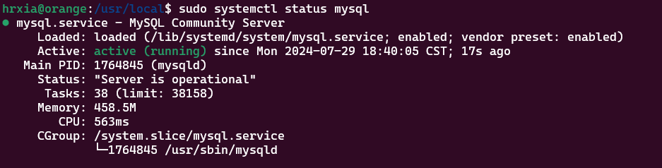

Set password and other configuration for mysql

```cmd
mysql -uroot -p
```

**Meet an problem:**

```cmd
Enter password:
ERROR 1045 (28000): Access denied for user 'root'@'localhost' (using password: NO)
```

Solution:

```cmd
sudo vim /etc/mysql/mysql.conf.d/mysqld.cnf
```

Add `skip-grant-tables` under `[mysqld]` to skip password verification, then restart mysql

```cmd
sudo systemctl restart mysql
```

Set password

```cmd
ALTER USER 'root'@'%' IDENTIFIED WITH mysql_native_password BY '12345678';
flush privileges;
```

Delete the  `skip-grant-tables` under `[mysqld]` and restart mysql

## lua 

sysbench includes lots of `.lua` file to support the tests

Take database benchmarks for example, in `oltp_common.lua`, this file is kind of like a public function library, it states the basic functions needed for the tests:

```lua
-- Initialization
function init() 

-- Create table structure, get random strings for c and pad fields, insert data, and create secondary index
function create_table(drv, con, table_num) 
        -- Create table structure as follows
        -- CREATE TABLE `sbtest1` (
        -- 		`id` int(11) NOT NULL AUTO_INCREMENT, # Primary key
        -- 		`k` int(11) NOT NULL DEFAULT '0', # Secondary index
        -- 		`c` char(120) NOT NULL DEFAULT '',
        -- 		`pad` char(60) NOT NULL DEFAULT '',
        --	 	PRIMARY KEY (`id`),
        -- 		KEY `k_1` (`k`)
        -- 	) ENGINE=InnoDB AUTO_INCREMENT=1000001 DEFAULT CHARSET=latin1
        
        -- get_c_value() to get the value for field c
        -- get_pad_value() to get the value for field pad
        -- INSERT statement to insert into the related table until the specified table size is reached
        -- Create the secondary index k

-- Get the value for field c, returning a random string
function get_c_value() 

-- Get the value for field pad, returning a random string     
function get_pad_value() 

-- Initialize thread          
function thread_init() 
                    
-- Close thread connections                   
function thread_done() 

-- Close prepared statements
function close_statements() 

-- If we have reconnected, then prepare statements again                  
function sysbench.hooks.before_restart_event(errdesc)
    -- close_statements() // Close prepared statements
    -- prepare_statements() // This function is a 'callback' defined by individual benchmark scripts
                                
-- Construct statements                    
function prepare_for_each_table(key)   

-- Corresponding to prepare command                                    
function cmd_prepare() 
                                        
-- Corresponding to prewarm command                                        
function cmd_prewarm() 

-- Clean up data by dropping all related tables
function cleanup() 
 
-- Start transaction BEGIN
function prepare_begin() // Construct BEGIN statement
function begin() // Execute BEGIN statement

-- Commit transaction COMMIT
function prepare_commit() // Construct COMMIT statement
function commit() // Execute COMMIT statement

-- Primary key equality query SELECT c FROM sbtest? WHERE id = ?                                         
function prepare_point_selects() // Call prepare_for_each_table() to generate point_selects statement 
function execute_point_selects() // Execute the statement generated by prepare_point_selects()

-- Primary key range query SELECT c FROM sbtest? WHERE id BETWEEN ? AND ?
function prepare_simple_ranges() // Call prepare_for_each_table() to generate simple_ranges statement 
function execute_simple_ranges() // Execute the statement generated by prepare_simple_ranges()

-- Primary key range query + SUM SELECT SUM(k) FROM sbtest? WHERE id BETWEEN ? AND ?
function prepare_sum_ranges() // Call prepare_for_each_table() to generate sum_ranges statement       
function execute_sum_ranges() // Execute the statement generated by prepare_sum_ranges()

-- Primary key range query + ORDER BY SELECT c FROM sbtest%u WHERE id BETWEEN ? AND ? ORDER BY c           
function prepare_order_ranges()
function execute_order_ranges()                                                           

-- Primary key range query + ORDER BY + DISTINCT SELECT DISTINCT c FROM sbtest%u WHERE id BETWEEN ? AND ? ORDER BY c
function prepare_distinct_ranges()
function execute_distinct_ranges()                                                       

-- Update on secondary index (k is the secondary index) UPDATE sbtest%u SET k=k+1 WHERE id=?                           
function prepare_index_updates() // Call prepare_for_each_table() to generate index_updates statement 
function execute_index_updates() // Execute the statement generated by prepare_index_updates()

-- Non-indexed update UPDATE sbtest%u SET c=? WHERE id=?                                         
function prepare_non_index_updates() 
function execute_non_index_updates()                                                     

-- Delete DELETE FROM sbtest%u WHERE id=?
function prepare_delete_inserts()                                                         
function execute_delete_inserts() // Execute the statement generated by prepare_delete_inserts()

```

The following are the database commands used in the benchmarks:

```lua
-- point_selects: Primary key equality query
SELECT c FROM sbtest%u WHERE id=?

-- simple_ranges: Simple range query (primary key range)
SELECT c FROM sbtest%u WHERE id BETWEEN ? AND ?

-- sum_ranges: Range summation (sum based on simple range query)
SELECT SUM(k) FROM sbtest%u WHERE id BETWEEN ? AND ?

-- order_ranges: Simple range query (with sorting based on primary key range)
SELECT c FROM sbtest%u WHERE id BETWEEN ? AND ? ORDER BY c

-- distinct_ranges: Distinct range query (primary key range + sorting + distinct)
SELECT DISTINCT c FROM sbtest%u WHERE id BETWEEN ? AND ? ORDER BY c

-- index_updates: Index update operation
UPDATE sbtest%u SET k=k+1 WHERE id=?

-- non_index_updates: Non-index update
UPDATE sbtest%u SET c=? WHERE id=?

-- deletes: Delete operation
DELETE FROM sbtest%u WHERE id=?

-- inserts: Insert operation
INSERT INTO sbtest%u (id, k, c, pad) VALUES (?, ?, ?, ?)

```

## Test the performance

**Requirements:** test 64 tables, each with size of 10,000,000

**Configuration**:

CPU Information

| Property            | Value                                                        |
| ------------------- | ------------------------------------------------------------ |
| Architecture        | x86_64                                                       |
| CPU op-mode(s)      | 32-bit, 64-bit                                               |
| Address sizes       | 46 bits physical, 48 bits virtual                            |
| Byte Order          | Little Endian                                                |
| CPU(s)              | 20                                                           |
| On-line CPU(s) list | 0-19                                                         |
| Vendor ID           | GenuineIntel                                                 |
| Model name          | 13th Gen Intel(R) Core(TM) i5-13600K                         |
| CPU family          | 6                                                            |
| Model               | 183                                                          |
| Thread(s) per core  | 2                                                            |
| Core(s) per socket  | 14                                                           |
| Socket(s)           | 1                                                            |
| Stepping            | 1                                                            |
| CPU(s) scaling MHz  | 65%                                                          |
| CPU max MHz         | 5100.0000                                                    |
| CPU min MHz         | 800.0000                                                     |
| BogoMIPS            | 6988.80                                                      |

Cache Information

| Cache Type | Size    | Instances |
| ---------- | ------- | --------- |
| L1d        | 544 KiB | 14        |
| L1i        | 704 KiB | 14        |
| L2         | 20 MiB  | 8         |
| L3         | 24 MiB  | 1         |

memory Information

| Type | Total | Used  | Free  | Shared | Buff/Cache | Available |
| ---- | ----- | ----- | ----- | ------ | ---------- | --------- |
| Mem  | 31Gi  | 3.6Gi | 15Gi  | 53Mi   | 12Gi       | 27Gi      |
| Swap | 2.0Gi | 204Mi | 1.8Gi | -      | -          | -         |

### TEST

create a config file `vim sysbench-thread-64.cfg`:

```cmd
# write the following into the file
mysql-user=****  				# your mysql user
mysql-password=****  			# password
mysql-db=systest  				# your database name
time=60  						# max benchmarking time
threads=64  					# 64 concurrent threads
report-interval=10  			# output test procedure every 10 sec
db-driver=mysql
```

#### Point select benchmark:

Prepare the tables and data used for test, this takes a lot of time, be patient:

```cmd
sysbench --config-file=sysbench-thread-64.cfg oltp_point_select --tables=64 --table-size=10000000 prepare
```

Show tables:

```cmd
mysql> show tables from systest;
+-------------------+
| Tables_in_systest |
+-------------------+
| sbtest1           |
| sbtest10          |
| sbtest11          |
| sbtest12          |
| sbtest13          |
| sbtest14          |
| sbtest15          |
| sbtest16          |
| sbtest17          |
| sbtest18          |
| sbtest19          |
| sbtest2           |
| sbtest20          |
| sbtest21          |
| sbtest22          |
| sbtest23          |
| sbtest24          |
| sbtest25          |
| sbtest26          |
| sbtest27          |
| sbtest28          |
| sbtest29          |
| sbtest3           |
| sbtest30          |
| sbtest31          |
| sbtest32          |
| sbtest33          |
| sbtest34          |
| sbtest35          |
| sbtest36          |
| sbtest37          |
| sbtest38          |
| sbtest39          |
| sbtest4           |
| sbtest40          |
| sbtest41          |
| sbtest42          |
| sbtest43          |
| sbtest44          |
| sbtest45          |
| sbtest46          |
| sbtest47          |
| sbtest48          |
| sbtest49          |
| sbtest5           |
| sbtest50          |
| sbtest51          |
| sbtest52          |
| sbtest53          |
| sbtest54          |
| sbtest55          |
| sbtest56          |
| sbtest57          |
| sbtest58          |
| sbtest59          |
| sbtest6           |
| sbtest60          |
| sbtest61          |
| sbtest62          |
| sbtest63          |
| sbtest64          |
| sbtest7           |
| sbtest8           |
| sbtest9           |
+-------------------+
64 rows in set (0.01 sec)
```

Table structure:

```mysql
mysql> show create table sbtest1;
+---------+----------------------------------------------------------------------------------------------------------------------------------------------------------------------------------------------------------------------------------------------------------------------------------------+
| Table   | Create Table

                                                                           |
+---------+----------------------------------------------------------------------------------------------------------------------------------------------------------------------------------------------------------------------------------------------------------------------------------------+
| sbtest1 | CREATE TABLE `sbtest1` (
  `id` int NOT NULL AUTO_INCREMENT,
  `k` int NOT NULL DEFAULT '0',
  `c` char(120) NOT NULL DEFAULT '',
  `pad` char(60) NOT NULL DEFAULT '',
  PRIMARY KEY (`id`)
) ENGINE=InnoDB AUTO_INCREMENT=8331674 DEFAULT CHARSET=utf8mb4 COLLATE=utf8mb4_0900_ai_ci |
+---------+----------------------------------------------------------------------------------------------------------------------------------------------------------------------------------------------------------------------------------------------------------------------------------------+
1 row in set (0.01 sec)
```

While preparing data, using the following commend to see progress:

```mysql
mysql> select count(*) from sbtest1;
+----------+
| count(*) |
+----------+
|   181832 |
+----------+
1 row in set (0.02 sec)
```

The `oltp_point_select.lua` file:

```lua
-- Load the oltp_common script
require("oltp_common")

-- Construct point select statements
prepare_statements()

-- Execute the statements
event()

```

Run the `point-select`benchmark, 64 threads:

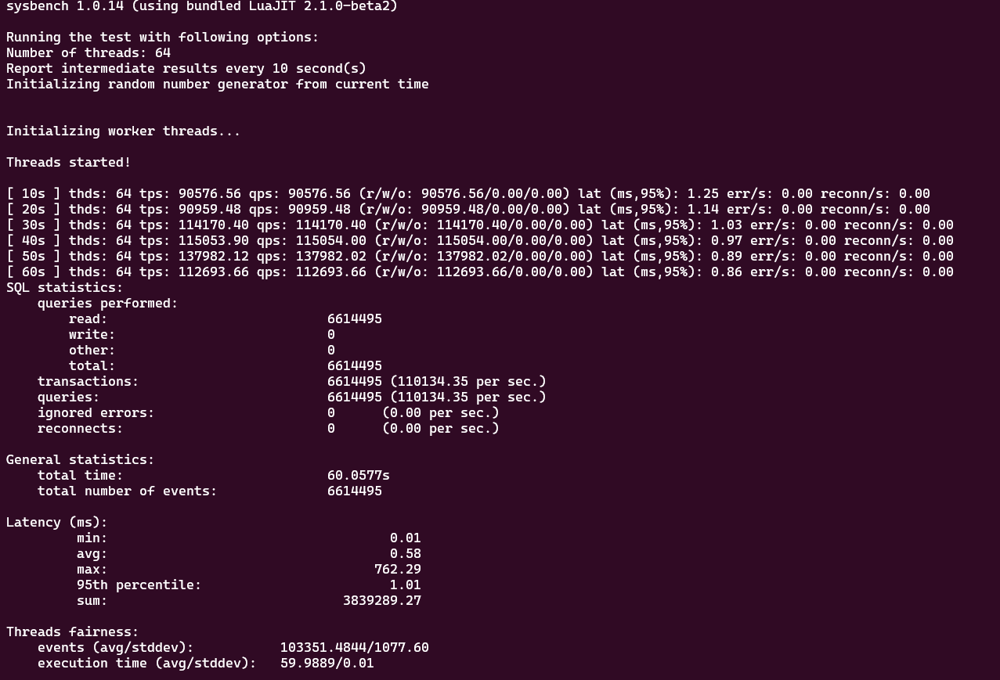

| Time | Threads | TPS        | QPS        | Read QPS   | Write QPS | Other QPS | 95% Latency (ms) | Errors/s | Reconnects/s |
| ---- | ------- | ---------- | ---------- | ---------- | --------- | --------- | ---------------- | -------- | ------------ |
| 10s  | 64      | 90,576.56  | 90,576.56  | 90,576.56  | 0.00      | 0.00      | 1.25             | 0.00     | 0.00         |
| 20s  | 64      | 90,959.48  | 90,959.48  | 90,959.48  | 0.00      | 0.00      | 1.14             | 0.00     | 0.00         |
| 30s  | 64      | 114,170.40 | 114,170.40 | 114,170.40 | 0.00      | 0.00      | 1.03             | 0.00     | 0.00         |
| 40s  | 64      | 115,053.90 | 115,054.00 | 115,054.00 | 0.00      | 0.00      | 0.97             | 0.00     | 0.00         |
| 50s  | 64      | 137,982.12 | 137,982.02 | 137,982.02 | 0.00      | 0.00      | 0.89             | 0.00     | 0.00         |
| 60s  | 64      | 112,693.66 | 112,693.66 | 112,693.66 | 0.00      | 0.00      | 0.86             | 0.00     | 0.00         |

| Metric                  | Value           |
| ----------------------- | --------------- |
| Minimum Latency         | 0.01 ms         |
| Average Latency         | 0.58 ms         |
| Maximum Latency         | 762.29 ms       |
| 95th Percentile Latency | 1.01 ms         |
| Total Latency Sum       | 3,839,289.27 ms |

Try to run the benchmark with different thread numbers:

**Meet a problem**:

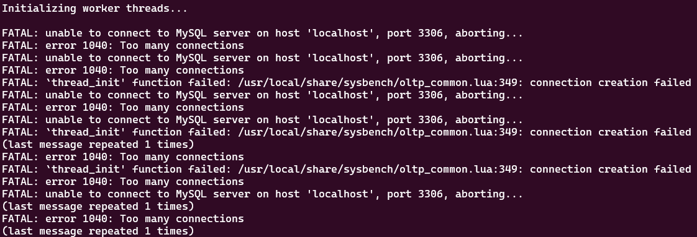

It shows that the total connections exceed the max connections

Solution:

First check the max connection allowed by the command `show variables like '%max_connections%';`, and then we can set the max connections based on our needs `set GLOBAL max_connections = 5000;`

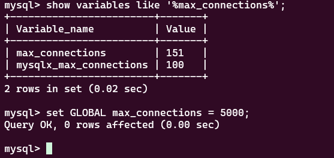

**Meet another problem**:

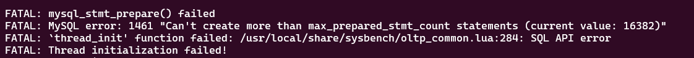

This is because the `max_prepared_stmt_count` parameter limits the maximum number of prepared statements across all sessions in `mysqld` at any given time. Its value range is "0 - 1048576," with a default of 16382. MySQL will return error 1461 for any prepare statement that exceeds the `max_prepared_stmt_count` limit.

Solution:

```mysql
mysql> set global max_prepared_stmt_count=124000;
```

**Benchmark result**:

Due to there are 6 records in each test, I calculate the `QPS` and `TPS` on average，use `generate.py` to organize data and plot graph

| Threads | QPS       | TPS       | 95% Latency (ms) | Minimum Latency | Average Latency | Maximum Latency | Total Latency Sum |
| ------- | --------- | --------- | ---------------- | --------------- | --------------- | --------------- | ----------------- |
| 8       | 10845.97  | 10845.97  | 12.75            | 0.19            | 9.68            | 16.41           | 58.07             |
| 16      | 50027.46  | 50027.46  | 0.34             | 0.22            | 0.29            | 0.34            | 1.75              |
| 32      | 92404.56  | 92404.56  | 0.42             | 0.39            | 0.44            | 0.53            | 2.64              |
| 64      | 110239.35 | 110239.35 | 0.86             | 0.86            | 1.02            | 1.25            | 6.14              |
| 128     | 129102.23 | 129102.23 | 2.48             | 1.73            | 2.90            | 3.96            | 17.40             |
| 256     | 112725.93 | 112725.93 | 9.73             | 9.73            | 11.48           | 14.46           | 68.86             |
| 512     | 119088.69 | 119088.69 | 25.74            | 25.74           | 29.01           | 32.53           | 174.08            |

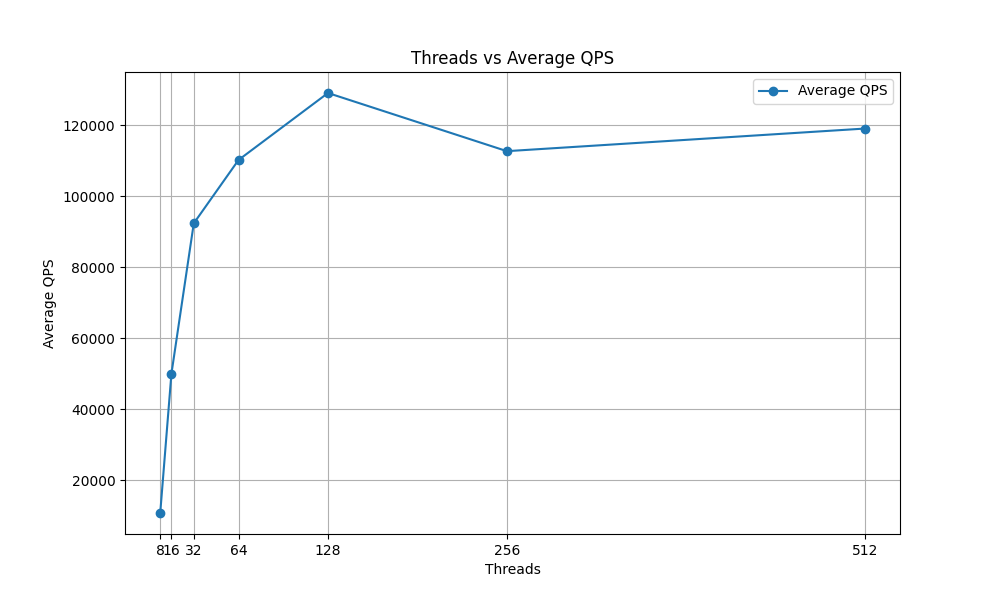

The initial increase in QPS and TPS is substantial as threads increase from 8 to 128, but the performance seems to plateau slightly at 256 and 512 threads, suggesting potential bottlenecks. These bottlenecks may be caused by that 256 or more threads exceed the maximum connection allowed by mysql by default, and too many threads attempt to connect simultaneously. Plus there are many records in each table, so new connections may be blocked or rejected, and itcan lead to reduced throughput.

While higher thread counts improve throughput (QPS/TPS), they also result in increased latencies, which can affect user experience. This highlights the importance of finding an optimal thread count for balancing throughput and latency.

**Reason analysis**:

First consider using the `perf` and `flamegraph` 

```cmd
# download the flamegraph tools
git clone https://github.com/brendangregg/FlameGraph.git
# perf record, 512 threads
perf record -aa -g -F99 sysbench --config-file=test.cfg oltp_point_select --tables=64 --table-size=10000000 --threads=512 run
# generate report
perf script | FlameGraph-master/stackcollapse-perf.pl | FlameGraph-master/flamegraph.pl > perf.svg
```

The `perf.svg` , we can see that there are a lot of `unknown` operations, it's hard to analyze, need another way

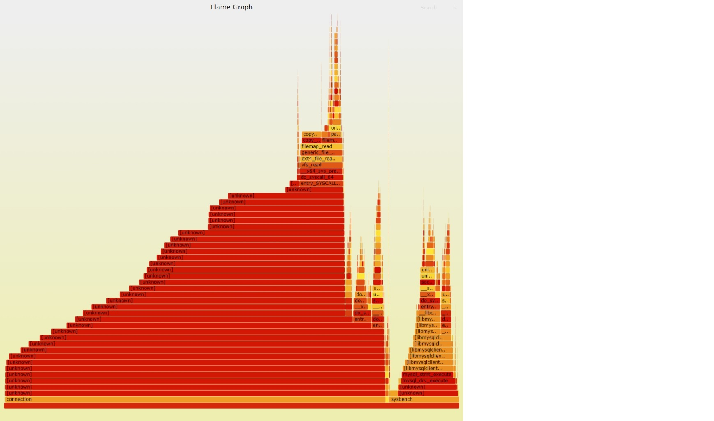

In order to locate the general reason why performance dropped after 128 threads, first try to get an insight into the hardware performance

Run `top` while running the benchmark with 128 threads

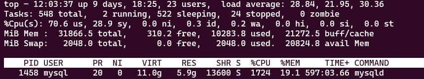

256 threads

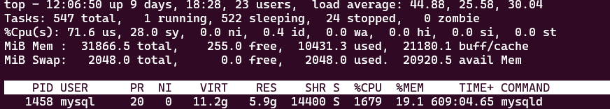

It can be seen that CPU usage didn't increase with more threads, I then ran the benchmark with 64 threads and 512 threads separately, finding that CPU usage **reaches the highest point** with 128 threads and didn't keep on increasing with more threads.

I also check the disk status using `dstat -d` command

128 threads:

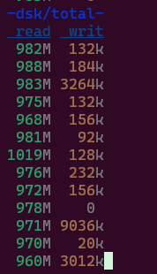

256 threads:

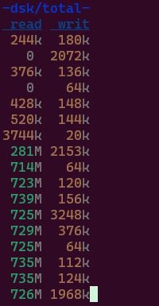

512 threads:

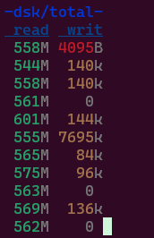

 The command shows the read and write capacity of disk per second. (E.x. read 558 MB from disk every second)

Apparently, the **read capacity significantly dropped** when the threads increase. It can be concluded that part of the reason why performance dropped can be due to the disk.

Then I analyze the performance of the disk, first use the `iostat -x 1`, this is meant to monitor the I/O queue of the disk

128 threads:

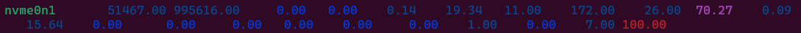

512 threads:


It can be seen that both test utilized 100% disk nvme0n1. However, the Average Queue Size(avgqu-sz) of the 128 thread test is larger than the 512 threads one.

Use the `vmstat 1` to check context switch number, check the `cs` column

128 threads:

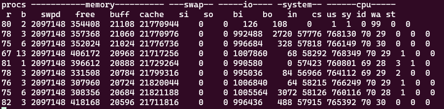

512 threads:

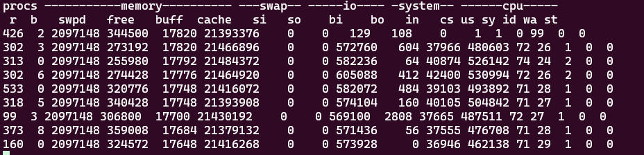

There are more context switch using 128 threads.

Analysis:

1. Context Switch
    When the number of threads increases, if the thread scheduler cannot effectively manage so many threads, it may cause some threads to be blocked for a long time or not get enough CPU time. In other words, the operating system's scheduler may have a large number of threads, and the priority scheduling mechanism will cause some threads to starve, and the actual context switch will be performed less often.
    Alternatively, it may be that MySQL thread pools or other kernel-level scheduling optimization policies reduce voluntary context switching in high-thread situations.
2. CPU utilization
    Reasons for the same CPU utilization:
    The same CPU utilization may be due to the fact that the CPU has reached the bottleneck in both 128and 512 threads cases. Even if the number of threads increases, the CPU utilization is saturated and cannot be further improved. Thus, CPU usage does not increase significantly even with more threads.
    Another possible reason is that with a high number of threads, the CPU time is spread among more threads, reducing the CPU time obtained by a single thread.
3. Disk read and write performance
    The disk reads less data per second with 512 threads than 128threads:
    Disk I/O is a finite resource and contention increases when the number of threads increases. If some threads occupy a large amount of I/O resources, it may cause other threads to wait for I/O, and the overall read and write performance will degrade. Therefore, more threads do not necessarily mean more data transfers, but may lead to an overall performance degradation.
    Bottlenecks in disk I/O may be caused by the lack of centralization of disk read operations due to I/O requests being more spread out at higher thread counts.
4. Average Queue Size (avgqu-sz)
    avgqu-sz denotes the average length of the I/O queue. If the queue size is larger at 128threads, this may mean that I/O requests are concentrated and the disk device is busy processing these requests, causing requests to queue.
    At 512 threads, more I/O requests are spread out, leading to a reduction in the queue length on a single device. Even if the overall I/O requests increase, because too many threads compete for resources, I/O requests are instead delayed or optimized by the kernel scheduling mechanism, making avgqu-sz smaller.

#### Write only benchmark

Create database `systest_wo`:

```cmd
mysql> create database systest_wo;
```

Prepare data:

```cmd
sysbench --config-file=write-only-64.cfg oltp_write_only --tables=64 --table-size=10000000 prepare
```


#### Read only benchmark

Create database `systest_ro`:

```cmd
mysql> create database systestrwo;
```

Prepare data:

```cmd
sysbench --config-file=read-only-64.cfg oltp_read_only --tables=64 --table-size=10000000 prepare
```

Test result:

| Threads | QPS       | TPS      | 95% Latency (ms) | Minimum Latency | Average Latency | Maximum Latency | Total Latency Sum |
| ------- | --------- | -------- | ---------------- | --------------- | --------------- | --------------- | ----------------- |
| 16      | 198932.22 | 12433.10 | 1.86             | 1.86            | 1.86            | 1.86            | 11.16             |
| 32      | 241508.90 | 15093.98 | 3.25             | 3.19            | 3.24            | 3.25            | 19.44             |
| 64      | 232253.35 | 14515.24 | 6.79             | 6.79            | 6.83            | 7.04            | 40.99             |
| 128     | 205049.39 | 12814.40 | 16.71            | 16.41           | 16.76           | 17.63           | 100.58            |
| 256     | 161984.06 | 10121.83 | 44.98            | 44.98           | 45.66           | 47.47           | 273.99            |
| 512     | 176424.42 | 11022.08 | 196.89           | 193.38          | 195.15          | 200.47          | 1170.88           |

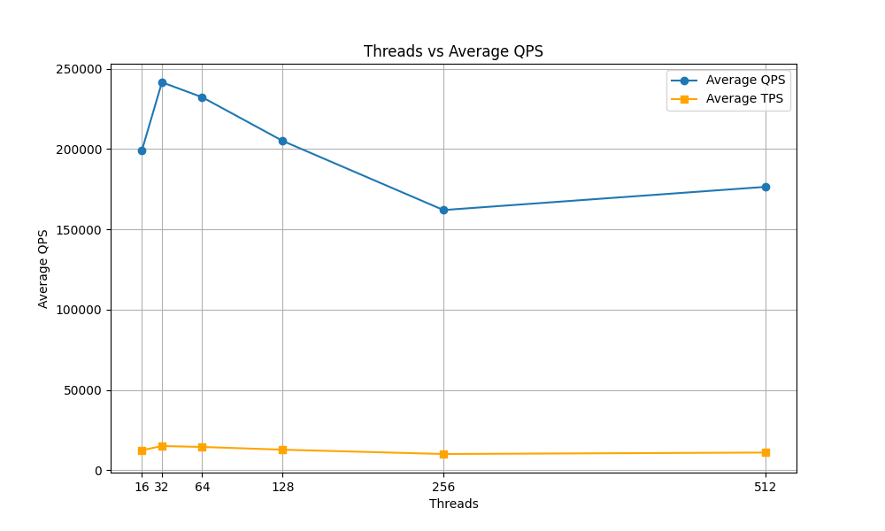

As the number of threads increases from 16 to 256, the Queries Per Second (QPS) initially increases, reaching a peak of 241,508.90 with 32 threads, then decreases to 161,984.06 with 256 threads.

The Transactions Per Second (TPS) also shows a similar trend, peaking at 15,093.98 with 32 threads before declining to 10,121.83 with 256 threads. This suggests that there may be an optimal number of threads for maximizing throughput, likely around 32 threads in this case.

**95% Latency**: This metric shows a substantial increase as the number of threads increases. It starts at 1.86 ms with 16 threads and rises to 196.89 ms with 512 threads. This indicates that the response time for the majority of requests becomes significantly worse as the thread count increases, likely due to contention and resource limitations.
